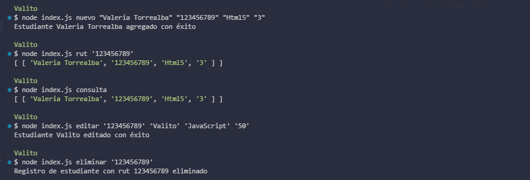

# Desafío Evaluado - Always Music v2

La escuela de música Always Music solicitó hacer unas pruebas con el avance del desarrollo
del sistema de gestión con base de datos PostgreSQL, se dieron cuenta que no se podían
hacer varias consultas de forma simultánea y que al intentar hacer una consulta errónea, no
recibían ningún error, dejando la posibilidad de creer que un estudiante fue registrado y que
esto no sea así.
En este desafío deberás ocupar la clase Pool definiendo sus diferentes propiedades, capturar
los posibles errores en el proceso de conexión con la base de datos y realizar las siguientes
consultas usando textos parametrizados.
  - Agregar un nuevo estudiante.
  - Consultar los estudiantes registrados.
  - Consultar estudiante por rut.
  - Actualizar la información de un estudiante.
  - Eliminar el registro de un estudiante.

